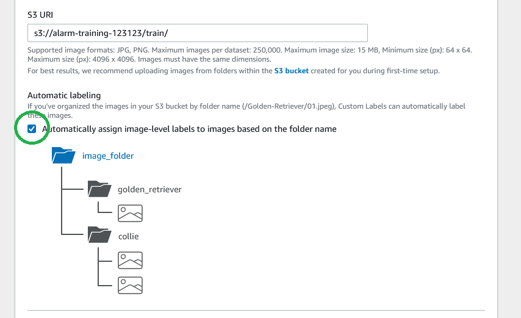
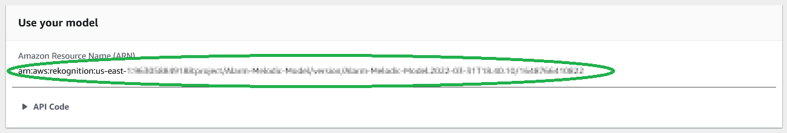
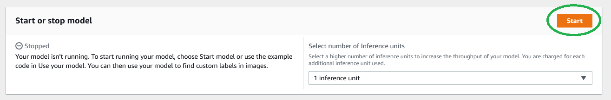

# Detect Audio Events with Amazon Rekognition

This project demonstrates the use of Rekognition to detect audio events when used in combination with spectrographic analysis. The project has two main aspects:

- Generating training data (spectrograms) from audio samples of background noise and alarms
- An inference pipeline to use the model to detect if a smoke alarm sound is present in an audio file

## Contents

- [Detect Audio Events with Amazon Rekognition](#detect-audio-events-with-amazon-rekognition)
  - [Contents](#contents)
  - [Requirements](#requirements)
  - [Organization](#organization)
  - [Building a training and validation data set](#building-a-training-and-validation-data-set)
    - [Configuration](#configuration)
      - [Paths](#paths)
      - [Combinations](#combinations)
    - [Running the training data generator](#running-the-training-data-generator)
  - [Building and Deploying the Inference Application](#building-and-deploying-the-inference-application)
  - [Actions Required for Alarm Detection](#actions-required-for-alarm-detection)
  - [Using the Deployed Solution](#using-the-deployed-solution)
  - [Cleanup](#cleanup)

## Requirements

You'll need python (3.8) and pip to use the test data generator

You'll need AWS SAM, Docker, and the AWS CLI installed in order to deploy the inference pipeline.

[SAM Installation instructions](https://aws.amazon.com/serverless/sam/)

[AWS CLI Installation instructions](https://aws.amazon.com/cli/)

[Install Docker community edition](https://hub.docker.com/search/?type=edition&offering=community)

&nbsp;

**:arrow_up_small: _Back to [Table of Contents](#contents)._**

## Organization

This project contains source code and supporting files for a utility to generate training spectrograms and a serverless application that you can deploy with the SAM CLI. It includes the following files and folders:

- util - Code to generate training, test and validation data sets, suitable for use with Rekognition Custom Labels
- inference - Code for the application's Lambda functions

The application uses several AWS resources, including Lambda functions. These resources are defined in the `template.yaml` file in this project. You can update the template to add AWS resources through the same deployment process that updates your application code.

**:arrow_up_small: _Back to [Table of Contents](#contents)._**

&nbsp;

## Building a training and validation data set

The `create_training_data.py` script loads in a set of alarm sound files and a set of background sound files.  It combines those sounds (including layering multiple background sounds on top of each other) to create a set of sample sounds.  Each resulting sound is then converted into a set of different types of spectrogram images.  This variety of spectrograms (including Mel, Harmonic, and others) can be tested to determine which spectrogram type works best with your data set.

### Configuration
By default, this code will look for the audio files in the directories `../audio/alarms` and `../audio/background` and create training data images in folders starting at `../training-data/`.  You can change these defaults by setting an environment variable:

1. `ALARM_AUDIO_SOURCE`: specifies a directory containing samples of the alarm (*default = ../audio/alarms*).  The alarm samples should be the same length as the `SAMPLE_DURATION`
2. `BACKGROUND_AUDIO_SOURCE`: specifies a directory containing samples of background sounds (*default = ../audio/background*).  The background samples should be longer (ideally much longer) than the `SAMPLE_DURATION`
3. `TARGET_PATH`: specifies where to build the training directory structure and place the spectrographic images (*default = ../training-data*)
:arrow_up_small: _Up to [Section Configuration](#configuration)._

#### Training Data Details

`create_training_data.py` creates combinations of sound samples, ready for use as training data for a Rekognition Custom Label job.  There are two main categories for these samples: with alarm, and without alarm.

Each training sample image is created by mixing one or more background sounds with 0 or 1 alarm sounds to create a composite sound, which is then converted to an image.  The maximum number of background sounds used is specified with the MAX_BACKGROUND_LAYERS parameter.  The code layers multiple background sounds in order to produce a wider variety of training data, which results in less false positive results and false negative results.

Note that the samples are created using 1 background sound, then 2, then 3, and so on, until MAX_BACKGROUND_LAYERS have been created.  This means that if you specify MAX_BACKGROUND_LAYERS to be 4, you will get a set of training data created from 1 background sound, then 2, then 3, and then 4 background sounds.

:arrow_up_small: _Up to [Section Configuration](#configuration)._
:arrow_up_small: _Up to [Section Building a training and validation data set](#building-a-training-and-validation-data-set)._

### Running the training data generator

Once the samples have been placed in the configured directories it is now time to configure the python environment and run the application.

**Recommended Approach**1. From within the util directory, configure the environment (Linux/bash), then run the code:
   ```bash
   python3 -m venv .venv
   source .venv/bin/activate
   pip3 install -r requirements.txt
   python3 create_training_data.py
   ```
2. The code will build within your target directory three folders, with two sub-folders each.
   ```
   /<TARGET_PATH>
   ├── test
   │   ├── alarm
   │   └── no_alarm
   ├── train
   │   ├── alarm
   │   └── no_alarm
   └── validate
       ├── alarm
       └── no_alarm
   ```
3. You will need to copy the full folder structure and the contained images into an S3 Bucket (preferably not the bucket created later by the Inference Application)
4. Instruction on how to create a custom label project can be found here: [Creating an Amazon Rekognition Custom Labels Project](https://docs.aws.amazon.com/rekognition/latest/customlabels-dg/mp-create-project.html)
5. Instruction on how to create a dataset for your project from the images in S3 can be found here [Creating a dataset by importing images from an S3 bucket](https://docs.aws.amazon.com/rekognition/latest/customlabels-dg/md-create-dataset-s3.html).  Be sure to follow the instructions for `Separate training and test datasets` and to check the box next to `Automatically attach labels to images based on the folder` for both the training and test datasets

   
6. Now that we have a dataset that contains training and test data, we can train the model.  Either select `Train Model` from the Datasets info screen or from your project info screen.  Training will take 30-90 minutes normally but can take as long as 24 hours.
7. Once training is complete, review the evaluation information for the model you just trained.  If the results are acceptable (based on your business needs, for this project our metric was above an F1 score above 0.95), then proceed.  If not try larger numbers of training images or better samples of the original alarm.
8. On the `Use Model` tab of the model screen, you will need to do two things:
   1. Find the ARN of the trained Rekognition model, save it as you will need it for the Inference Application

      
   2. Start the model for use by the Inference Application.  *Reminder: Rekognition charges by time for custom labels see:[Amazon Rekognition Custom Labels pricing](https://aws.amazon.com/rekognition/pricing/?nc=sn&loc=4)*

      
:arrow_up_small: _Up to [Section Building a training and validation data set](#building-a-training-and-validation-data-set)._
**:arrow_up_small: _Back to [Table of Contents](#contents)._**

&nbsp;

## Building and Deploying the Inference Application

The Serverless Application Model Command Line Interface (SAM CLI) is an extension of the AWS CLI that adds functionality for building and testing Lambda applications. It uses Docker to run your functions in an Amazon Linux environment that matches Lambda.

To build and deploy your application for the first time, run the following in your shell/command prompt:

```bash
sam build --use-container
sam deploy --guided
```

The first command will build the source of your application. The second command will package and deploy your application to AWS, with a series of prompts.

**:arrow_up_small: _Back to [Table of Contents](#contents)._**

## Actions Required for Alarm Detection

The alarm detection component requires a running Amazon Rekognition Custom Labels job. The steps required to train such a model above. The resulting Arn (Amazon Resource Name) of the model is needed, and must be inserted into the file `template.yaml`, replacing the `CHANGE_ME` value in the `Parameters` section.

Before using the pipeline, be sure to start the custom label model through the AWS console. Since use of the custom labels feature is based on time, be sure to shut down the model when done using it, to avoid extra costs.

**:arrow_up_small: _Back to [Table of Contents](#contents)._**

## Using the Deployed Solution

To submit a job to the inference system, simply drop a new audio file in the S3 bucket that has been created.

**:arrow_up_small: _Back to [Table of Contents](#contents)._**

## Cleanup

To delete the sample application that you created, use the SAM CLI. Substitute your stack name as the parameter:

```bash
sam delete --stack-name sound-detect-blog
```


**:arrow_up_small: _Back to [Table of Contents](#contents)._**
